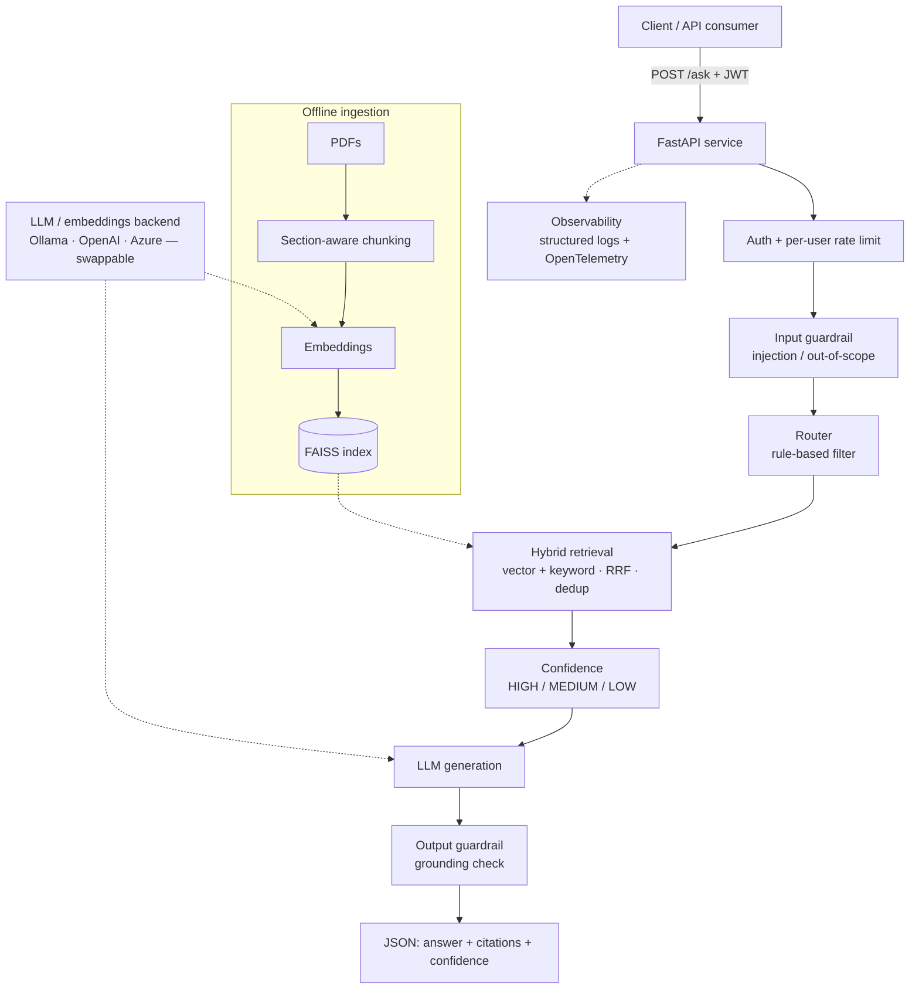

# 🚢 RAG Logistics Assistant


A production-style **Retrieval-Augmented Generation (RAG)** service that answers natural-language questions over logistics software manuals and customs/regulatory documents (CBP, FDA, APHIS). It returns **grounded answers with section-level citations and a confidence rating**, behind authentication, rate limiting, guardrails, and full observability.

The system is **backend-agnostic**: it runs on a free local model (Ollama) for development and switches to Azure OpenAI or OpenAI by changing a single environment variable — no code changes.

---

## What it does

Ask a question over HTTP → the service retrieves the most relevant passages from your indexed PDFs (hybrid vector + keyword search), sends them to an LLM as context, verifies the answer is grounded in those sources, and returns structured JSON.

**Request flow:**

```
POST /ask  (JWT auth + per-user rate limit)
  → input guardrail   (block prompt-injection / out-of-scope)
  → route             (fast rule-based document-type filter)
  → retrieve          (vector + keyword, fused with RRF, section-deduped)
  → confidence        (HIGH / MEDIUM / LOW from best match)
  → generate          (LLM answers from the retrieved context)
  → output guardrail  (verify the answer is grounded in the sources)
  → { answer, citations, confidence }
```

Every stage is timed and logged with a correlating `request_id`, and traced with OpenTelemetry.



---

## Features

- **Structure-aware ingestion** — PDFs are chunked along document sections, preserving `section` + page numbers so answers can cite "Section X, pages 4–5".
- **Hybrid retrieval with Reciprocal Rank Fusion (RRF)** — vector search for meaning + keyword search for exact identifiers (HTS codes, CFR numbers), fused by rank so two incomparable score scales combine cleanly. Section-level dedup keeps citations clean.
- **Layered guardrails** — input-side prompt-injection / jailbreak detection and out-of-scope rejection (runs before any compute); output-side grounding check that refuses answers not supported by the retrieved text.
- **Confidence scoring** — HIGH / MEDIUM / LOW derived from the best retrieval match, used to trigger fallbacks.
- **Provider seam** — one `LLM_PROVIDER` env var selects Ollama (local), OpenAI, or Azure OpenAI. Chat and embeddings share one configuration.
- **Production API** — FastAPI with JWT auth (`/token`), per-user sliding-window rate limiting, a cheap `/health` probe, consistent JSON error handling, and real Server-Sent-Events streaming (`/ask/stream`).
- **Observability** — structured JSON logging with request IDs, per-stage latency timing, and OpenTelemetry tracing (console locally; swappable to Azure Monitor / CloudWatch in prod).
- **Evaluation** — a Precision@K / Recall@K benchmark over a labelled question set, so retrieval-quality changes can be measured.
- **Tested & CI-gated** — 44 pytest tests (running with fakes, no model or index needed) gate every push; ruff + black + mypy enforce style and types.

---

## Tech stack

| Layer | Technology |
| --- | --- |
| API | FastAPI (Uvicorn) |
| LLM / embeddings | Ollama (local default) · OpenAI · Azure OpenAI — selected by `LLM_PROVIDER` |
| Vector store | FAISS (local); swappable for Azure AI Search / Pinecone |
| Retrieval | Hybrid (vector + keyword) with RRF fusion |
| Auth | OAuth2 password flow + JWT (PyJWT) |
| Observability | Structured logging + OpenTelemetry |
| Testing / quality | pytest · ruff · black · mypy |
| CI | GitHub Actions |
| PDF processing | LangChain loaders + splitters |

---

## Quickstart (local, free — no cloud account)

Runs entirely on your machine with a local model. Full details in **[OLLAMA_SETUP.md](OLLAMA_SETUP.md)**.

```bash
# 1. Install Ollama (ollama.com) and pull the models
ollama pull llama3.2
ollama pull nomic-embed-text

# 2. Set up the environment
python -m venv venv && source venv/bin/activate   # Windows: venv\Scripts\activate
pip install -r requirements.txt
cp .env.example .env                               # defaults point at Ollama

# 3. Build the search index from the PDFs in data/raw/
python ingest.py

# 4. Run the API
uvicorn app:app --reload
# Swagger UI: http://127.0.0.1:8000/docs
```

Get a token from `POST /token` (demo creds: `analyst` / `demo`), then call `POST /ask` with `{ "question": "..." }`.

**To use Azure OpenAI or OpenAI instead**, edit `.env` (`LLM_PROVIDER=azure` or `openai`) — no code changes.

---

## Tests & CI

```bash
pip install -r requirements-dev.txt
python -m pytest -v          # 44 tests, no model/index required
ruff check . && black --check . && mypy src
```

CI (`.github/workflows/ci.yml`) runs on every push:

- **`test` job (blocking):** runs the full pytest suite — the real quality gate.
- **`lint` job:** ruff + black enforced, mypy advisory.

The retrieval benchmark runs **locally** (`python -m src.evaluation.benchmark`), not in CI, because it needs the model and index. Its metric functions are unit-tested in CI.

---

## Project structure

```
app.py                     FastAPI app (endpoints, auth, rate limit, errors)
ingest.py / main.py        Offline ingestion → FAISS index
src/config/settings.py     Single source of truth for configuration
src/llm/                   provider seam + chat client + prompts
src/embeddings/            embedding client
src/ingestion/ + preprocessing/   PDF load, metadata, section-aware chunking
src/vectorstore/           FAISS wrapper + index builder
src/retrieval/             keyword search + hybrid retriever (RRF)
src/rag/                   query router + pipeline orchestrator
src/guardrails/            input validator + output grounding
src/evaluation/            confidence, metrics, benchmark
src/api/                   JWT auth + rate limiter
src/observability/         logging, timing, OpenTelemetry tracing
tests/                     44 tests (fakes; no model/index)
```

---

## Design decisions & trade-offs

**FAISS vs a managed vector DB** — FAISS is lightweight, free, and offline, ideal for development. It's brute-force and single-process; at scale you'd move to Azure AI Search / Pinecone behind the same interface.

**RRF for hybrid retrieval** — vector distance and keyword-overlap counts aren't comparable, so results are fused by *rank* (`sum of 1/(60 + rank)`) rather than raw score. Documents ranked highly by both sources rise to the top.

**Rule-based routing** — an earlier LLM-based router cost ~10 seconds per request (surfaced by the per-stage timing). It was replaced with cheap keyword rules (LLM kept as an optional fallback), removing that latency with no quality loss.

**Provider abstraction** — depending on an interface rather than a specific vendor makes the system testable and cloud-portable, and is why the test suite runs with no model.

---

## Production considerations

This repo is a portfolio-grade build with clearly marked boundaries. For real production you would:

- Swap demo JWT credentials for an identity provider (Entra ID / Auth0, OIDC) with the signing secret in Key Vault.
- Back the in-memory rate limiter with Redis so limits hold across instances.
- Replace local FAISS with a managed vector store (Azure AI Search).
- Export traces/metrics to Azure Monitor or CloudWatch.
- Add contract + load tests and flip the lint gate to blocking after a formatting pass.

---

## License

MIT License — Copyright (c) 2026 Neelima Naik
